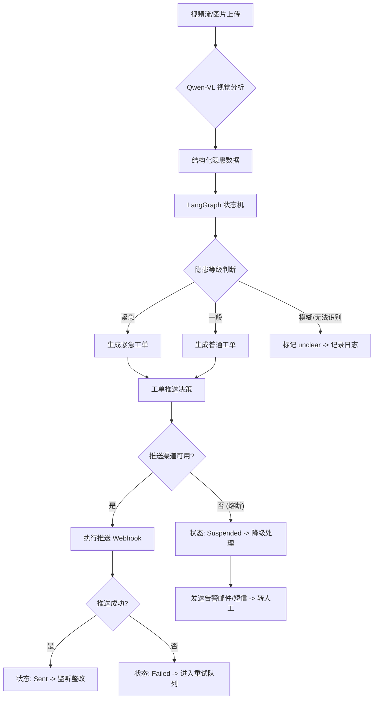
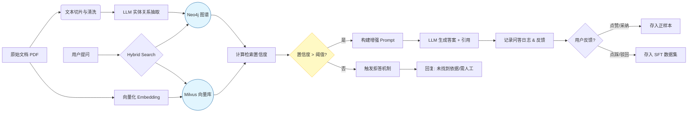
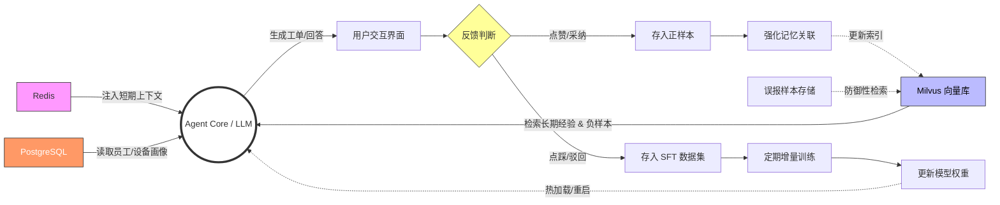
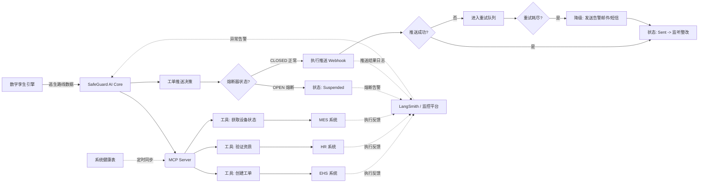

### 🏭 安卫智脑 (SafeGuard AI) 详细技术方案 (最终完整版)

**项目背景**：面向制造业的安全生产全生命周期管理，打造具备“感知-认知-记忆-行动”闭环的 AI 安全员。
**当前环境**：2026年6月，工业5.0深化期，要求系统具备自进化与强一致性。

------

### 📂 模块一：隐患智能研判与闭环处置工作流

**定位**：系统的“业务前台”，负责端到端的任务执行与流程管控。

| 功能点 | 功能名称             | 技术实现方案                                                 | 关键技术/工具              |
| ------ | -------------------- | ------------------------------------------------------------ | -------------------------- |
| **1**  | **多模态隐患识别**   | 1. **输入**：RTSP 视频流抽帧或图片上传。 2. **推理**：调用 **Qwen-VL-Max** 或 **GPT-4o** 视觉模型。 3. **Prompt Engineering**：设计 Few-shot CoT 模板，强制输出 JSON 格式的 `隐患类型`、`坐标(bbox)`、`置信度`。 **(增强)**：增加防御性规则，若图像模糊或光线不足，强制输出 `type: 'unclear'`。 | OpenCV, Qwen-VL, CoT       |
| **12** | **数字巡检员**       | 1. **定时任务**：基于 `APScheduler` 设置 7x24 小时巡检计划。 2. **差异检测**：对比历史帧与当前帧的特征向量，识别“由通变堵”或“由在变无”的状态变化。 | APScheduler, Image Hashing |
| **17** | **自动化整改工单**   | 1. **生成**：基于 LLM 填充工单模板（隐患描述+法规依据）。 2. **分发**：通过 Webhook 或 SDK 推送至 **企业微信/钉钉** 或 **EHS 系统**。 3. **确认**：监听回调接口，更新工单状态。 **(增强)**：增加幂等性检查，防止重复推送。 | Jinja2 Template, Webhook   |
| **14** | **智能会议纪要**     | 1. **ASR**：使用 **Whisper-large-v4** 转录音频。 2. **NLP 提取**：利用 NER (命名实体识别) 提取“责任人”、“截止时间”、“决议项”。 3. **归档**：自动生成 Markdown 格式纪要并存入知识库。 | Whisper, SpaCy/NLTK        |
| **18** | **LangGraph 状态机** | 1. **定义 State**：`HazardState` (包含 messages, next_node, ticket_status)。 2. **编排逻辑**：`Supervisor` 节点根据隐患等级路由到 `UrgentHandler` 或 `NormalHandler`。 **(增强)**：增加 `retry_count` 和熔断机制，防止死循环。 | LangGraph, StateGraph      |

**模块一架构流程图 (严谨版)：**

**变更说明**：

1. 强化了 **"误报反馈"** 到 **"模型反思"** 的回流箭头。
2. 细化了 **"推送失败"** 的降级策略（邮件/短信）。
3. 增加了 **人工复核** 环节的明确分支。1



------

### 🧠 模块二：GraphRAG 动态知识引擎

**定位**：系统的“认知大脑”，解决幻觉问题，提供专业法规支持。

| 功能点 | 功能名称              | 技术实现方案                                                 | 关键技术/工具              |
| ------ | --------------------- | ------------------------------------------------------------ | -------------------------- |
| **2**  | **结构化知识库**      | 1. **数据清洗**：使用 `Unstructured` 库解析 PDF/Word 法规文档。 2. **向量化**：使用 **BGE-M3** 嵌入模型生成向量，存入向量数据库。 | Unstructured, BGE-M3       |
| **3**  | **本体驱动图谱**      | 1. **Schema 定义**：定义节点 `(法规:Law)`, `(设备:Equipment)`, `(隐患:Hazard)`。 2. **关系抽取**：利用 LLM 从文本中提取三元组 `(灭火器)-[检查周期]->(每月)`，写入 Neo4j。 | Neo4j, LLM Triplet Extract |
| **4**  | **GraphRAG 深度检索** | 1. **混合检索**：关键词检索 (Cypher) + 向量检索 (Embedding)。 2. **上下文增强**：将检索到的实体关系拼接到 Prompt 中，作为推理依据。 | Neo4j Vector Index         |
| **5**  | **法规变更影响分析**  | 1. **对比算法**：使用 Diff 算法对比新旧法规文本。 2. **影响推演**：在图谱中反向追溯受影响的设备和 SOP 节点。 | Text-Diff, Graph Traversal |
| **6**  | **零幻觉校验**        | 1. **引用机制**：强制要求 LLM 在回答中引用知识库的 ID 或条款号。 2. **拒答机制**：若置信度 < 0.7，回复“未找到确切依据”。 | Citation Chaining          |
| **15** | **个性化培训**        | 1. **推荐算法**：基于用户画像（见模块三）检索相关事故案例。 2. **自动生成题**：利用 LLM 将案例转化为选择题/判断题。 | Collaborative Filtering    |

**模块二架构流程图：**

**变更说明**：

1. 增加了 **"检索置信度判断"** 节点，防止低质量检索导致的幻觉。
2. 明确了 **"拒答机制"** 的流向。



------

### 🧠 模块三：多维自适应记忆系统

**定位**：系统的“数字灵魂”，实现经验积累与个性化服务。

| 功能点 | 功能名称           | 技术实现方案                                                 | 关键技术/工具                |
| ------ | ------------------ | ------------------------------------------------------------ | ---------------------------- |
| **7**  | **短期工作记忆**   | 1. **存储**：使用 **Redis** 存储对话历史。 2. **策略**：采用 `Window Buffer` 或 `Token Aware` 策略，仅保留最近 N 轮有效对话。 | Redis, LangChain Memory      |
| **8**  | **专家经验记忆**   | 1. **向量存储**：将资深安全员的处置方案存入 Milvus。 2. **检索**：当遇到类似隐患时，检索 Top-K 相似案例作为 Few-shot 示例。 **(增强)**：增加 Negative Sample 存储，记录常见误报场景。 | Milvus, Similarity Search    |
| **9**  | **员工安全画像**   | 1. **标签系统**：构建 `(员工)-[违章]->(类型)` 的关系图。 2. **更新机制**：定时从 HR 系统同步资质过期状态。 | GraphSAGE, Label Propagation |
| **10** | **设备全生命周期** | 1. **数据关联**：打通 MES 系统，获取设备维修/保养记录。 2. **风险评分**：基于故障频率计算设备风险指数。 | Time-Series DB               |
| **11** | **反思与进化**     | 1. **反馈回路**：监听用户对 AI 建议的“采纳/驳回”操作。 2. **微调数据**：将驳回的样本存入 SFT (监督微调) 数据集，定期增量训练。 **(增强)**：自动将误报图片加入 Negative Sample。 | RLHF, SFT Pipeline           |

**模块三架构流程图：**



------

### 🛠️ 模块四：MCP 跨系统协同与可观测性底座

**定位**：系统的“工程骨架”，负责连接物理世界与数字世界。

| 功能点 | 功能名称         | 技术实现方案                                                 | 关键技术/工具              |
| ------ | ---------------- | ------------------------------------------------------------ | -------------------------- |
| **13** | **智能合规审计** | 1. **MCP Server**：开发标准 MCP Server。 2. **工具调用**：实现 `check_permit(permit_id)` 工具，实时验证动火证状态。 | MCP Protocol, REST API     |
| **16** | **应急预案推演** | 1. **数字孪生集成**：接入 Unity/UE 引擎或 GIS 地图 API。 2. **算法**：结合 A* 算法与实时传感器（烟雾/温度）计算逃生路径。 | Digital Twin, A* Algorithm |
| **19** | **MCP 工具集成** | 1. **适配器**：开发 `EHSAdapter`, `HRAdapter`, `MESAdapter`。 2. **注册**：在 MCP Server 中注册所有工具，供 Agent 自主调用。 **(增强)**：集成熔断器模式 (Circuit Breaker)。 | Adapter Pattern, Hystrix   |
| **20** | **可观测性看板** | 1. **监控**：集成 **LangSmith** 或 **OpenTelemetry**。 2. **指标**：追踪 Latency, Token Cost, RAG Recall Rate, 工单闭环率。 | LangSmith, Prometheus      |

**模块四架构流程图：**



------

### 🏗️ 附录A：核心数据库表结构设计 (Final)

**设计原则**：

1. **多模态存储**：除了传统的关系型数据，重点设计了向量和图谱的存储结构。
2. **时序数据**：针对监控和设备状态，优化了时序数据的写入。
3. **合规审计**：所有关键操作表都包含 `created_by`, `created_at`, `tenant_id` 字段。
4. **连接器设计**：新增 `t_connector_config` 以支持 MCP 动态集成。
5. **事件溯源**：新增 `t_sync_event` 以保证多库数据最终一致性。
6. **增加并发控制**：所有核心业务表增加 `version` 字段，支持乐观锁，防止高并发更新冲突。

#### A.1 关系型数据库 (PostgreSQL) - 核心业务与画像

**1. 修改：隐患工单表 (t_hazard_ticket)**

- **优化点**：增加 `suspended` 状态，增加空间字段。

| 字段名             | 类型      | 约束                                    | 说明                              |
| :----------------- | :-------- | :-------------------------------------- | :-------------------------------- |
| `ticket_id`        | UUID      | PK                                      | 工单ID                            |
| `title`            | VARCHAR   |                                         | 工单标题                          |
| `level`            | INT       | 1-5                                     | 隐患等级 (1紧急)                  |
| `image_url`        | TEXT      |                                         | 现场图片OSS地址                   |
| `status`           | VARCHAR   | 'open/closed'                           | 业务状态                          |
| `delivery_status`  | VARCHAR   | 'pending/sent/ack/**suspended**/failed' | 推送状态 (新增 suspended)         |
| `delivery_channel` | VARCHAR   | 'webhook/sms/email'                     | 实际送达渠道                      |
| `assignee`         | VARCHAR   |                                         | 责任人ID                          |
| `deadline`         | TIMESTAMP |                                         | 截止时间                          |
| `timeout_at`       | TIMESTAMP |                                         | 超时时间点                        |
| `reject_count`     | INT       | DEFAULT  Carson 0                       | 驳回/误报次数                     |
| `last_error`       | TEXT      |                                         | 最后一次错误信息                  |
| `version`          | INT       | DEFAULT 0                               | 乐观锁版本号                      |
| `location_point`   | POINT     |                                         | **[新增]** 厂区坐标点 (经度,纬度) |
| `updated_at`       | TIMESTAMP |                                         | 最后更新时间                      |

**2. 新增：误报与反馈记录表 (t_feedback_log)**

- **作用**：支撑模块三的“反思与进化”。

| 字段名          | 类型      | 约束                        | 说明               |
| --------------- | --------- | --------------------------- | ------------------ |
| `log_id`        | BIGINT    | PK                          | 日志ID             |
| `emp_id`        | VARCHAR   |                             | 操作员工ID         |
| `image_id`      | VARCHAR   |                             | 对应的违规图片     |
| `feedback_type` | VARCHAR   | 'false_positive/irrelevant' | 反馈类型           |
| `comment`       | TEXT      |                             | 用户填写的驳回理由 |
| `created_at`    | TIMESTAMP |                             | 记录时间           |

**3. 新增：工单操作日志表 (t_ticket_audit)**

- **作用**：记录工单的每一次状态变更，用于审计和重建状态机。

| 字段名          | 类型      | 约束 | 说明                             |
| --------------- | --------- | ---- | -------------------------------- |
| `audit_id`      | BIGINT    | PK   | 审计ID                           |
| `ticket_id`     | UUID      |      | 关联工单                         |
| `action`        | VARCHAR   |      | 操作类型 (create, update, close) |
| `before_status` | VARCHAR   |      | 变更前状态                       |
| `after_status`  | VARCHAR   |      | 变更后状态                       |
| `operator`      | VARCHAR   |      | 操作人 (System/AI/User)          |
| `timestamp`     | TIMESTAMP |      | 操作时间                         |

**4. 修改：系统连接器配置表 (t_connector_config)**

- **优化点**：明确敏感字段的加密方式，增加 `encryption_key_id` 字段。

| 字段名              | 类型    | 约束 | 说明                           |
| :------------------ | :------ | :--- | :----------------------------- |
| `connector_id`      | VARCHAR | PK   | 连接器ID                       |
| `system_type`       | VARCHAR |      | (ehs, hr, mes)                 |
| `api_url`           | TEXT    |      | 接口地址                       |
| `auth_config`       | TEXT    |      | **[加密存储]** 认证信息 (密文) |
| `encryption_key_id` | VARCHAR |      | **[新增]** 使用的KMS密钥ID     |
| `field_mapping`     | JSON    |      | 字段映射规则                   |

**5. 保留与微调：员工画像表 (t_employee_profile)**

- **优化点**：增加 `updated_at` 以支持增量同步。

| 字段名             | 类型      | 约束           | 说明                  |
| :----------------- | :-------- | :------------- | :-------------------- |
| `emp_id`           | VARCHAR   | PK             | 员工工号              |
| `dept`             | VARCHAR   |                | 部门                  |
| `position`         | VARCHAR   |                | 岗位                  |
| `violation_count`  | INT       |                | 违章次数              |
| `last_train_score` | FLOAT     |                | 上次培训得分          |
| `risk_level`       | VARCHAR   | 'low/med/high' | 风险画像              |
| `cert_expiry_date` | DATE      |                | **[建议]** 证书到期日 |
| `updated_at`       | TIMESTAMP |                | 最后更新时间          |

**6. 新增：隐患事实宽表 (t_fact_hazard_daily)**

- **作用**：面向分析型场景 (OLAP)，预聚合隐患数据，支撑 E.1 可观测性看板的秒级响应。

| 字段名          | 类型    | 约束          | 说明                |
| :-------------- | :------ | :------------ | :------------------ |
| `date_key`      | DATE    | PK            | 日期键 (YYYY-MM-DD) |
| `equipment_id`  | VARCHAR |               | 关联设备ID          |
| `dept_id`       | VARCHAR |               | 部门ID              |
| `hazard_type`   | VARCHAR |               | 隐患类型代码        |
| `hazard_level`  | INT     | 1-5           | 隐患等级            |
| `status`        | VARCHAR | 'open/closed' | 当日最终状态        |
| `create_count`  | INT     |               | 当日新增数量        |
| `resolve_count` | INT     |               | 当日解决数量        |

**7. 新增：Prompt 模板配置表 (t_prompt_template)**

- **作用**：实现大模型提示词的动态管理，无需重新部署代码即可调整 AI 行为（如法规变更适配）。

| 字段名        | 类型    | 约束         | 说明                                             |
| :------------ | :------ | :----------- | :----------------------------------------------- |
| `template_id` | BIGINT  | PK           | 模板ID                                           |
| `scene`       | VARCHAR |              | 场景标识 (e.g., ticket_gen, qa,summary_compress) |
| `name`        | VARCHAR |              | 模板名称                                         |
| `content`     | TEXT    |              | Jinja2 模板：用于压缩长文本对话历史              |
| `version`     | VARCHAR |              | 模板版本号                                       |
| `is_active`   | BOOLEAN | DEFAULT TRUE | 是否启用                                         |
| `updated_by`  | VARCHAR |              | 更新人                                           |

**8. 新增：系统健康与熔断表 (t_system_health)**

- **作用**：支撑模块四 MCP 底座的熔断器监控。

| 字段名                | 类型        | 约束          | 默认值              | 说明                                                    |
| --------------------- | ----------- | ------------- | ------------------- | ------------------------------------------------------- |
| `service_id`          | VARCHAR(32) | **PK**        | -                   | 服务标识（`cloud_vl`/`edge_pre_filter`/`alarm_engine`） |
| `cpu_load_cloud`      | FLOAT       | CHECK(0≤≤100) | 0.0                 | 云端CPU负载（%）                                        |
| `cpu_load_edge`       | FLOAT       | CHECK(0≤≤100) | 0.0                 | **边缘端CPU负载**（%）                                  |
| `memory_usage`        | FLOAT       | CHECK(0≤≤100) | 0.0                 | 内存使用率（%）                                         |
| `request_rate`        | FLOAT       |               | 0.0                 | 请求吞吐量（QPS）                                       |
| `error_rate`          | FLOAT       | CHECK(0≤≤100) | 0.0                 | 错误率（%）                                             |
| `circuit_state`       | VARCHAR(16) | NOT NULL      | `closed`            | **熔断器状态**（`closed`/`open`/`half_open`）           |
| `last_circuit_change` | TIMESTAMP   |               | `CURRENT_TIMESTAMP` | 熔断状态最后变更时间                                    |
| `degraded_reason`     | VARCHAR(64) |               | `null`              | 降级原因（如 `high_false_positive`/`edge_overload`）    |
| `updated_at`          | TIMESTAMP   | NOT NULL      | `CURRENT_TIMESTAMP` | 记录更新时间                                            |

**9. 新增：设备-摄像头映射表 (t_camera_equipment_map)**

- **作用**：支撑数字孪生与 GIS 引擎的坐标定位。

| 字段名             | 类型        | 约束      | 默认值         | 说明                                                         |
| ------------------ | ----------- | --------- | -------------- | ------------------------------------------------------------ |
| `camera_id`        | VARCHAR(32) | **PK**    | -              | 摄像头唯一ID（格式：`CAM_{厂区缩写}_{序号}`）                |
| `equipment_id`     | VARCHAR(32) | FK        | -              | 关联设备ID（外键至 `t_equipment`）                           |
| `area_type`        | VARCHAR(16) | NOT NULL  | `production`   | **区域类型**（`production`/`rest`/**hazard**/`warehouse`）   |
| `geo_json`         | TEXT        |           | `null`         | 监控区域GeoJSON多边形（示例：`{"type":"Polygon","coordinates":}`） |
| `rtsp_url`         | TEXT        | ENCRYPTED | -              | **加密存储**的视频流地址（AES-256）                          |
| `resolution`       | VARCHAR(16) |           | `1080p`        | 视频分辨率（`720p`/`1080p`/`4K`）                            |
| `frame_rate`       | INT         | CHECK(≥1) | 15             | 抽帧频率（帧/秒）                                            |
| `privacy_mode`     | BOOLEAN     | NOT NULL  | `false`        | 是否启用隐私脱敏（人脸/车牌模糊）                            |
| `last_maintenance` | DATE        |           | `CURRENT_DATE` | 最后维护日期                                                 |
| `status`           | VARCHAR(16) | NOT NULL  | `active`       | 状态（`active`/`degraded`/`offline`）                        |

**10. 新增：Prompt 版本历史表 (t_prompt_version)**

- **作用**：支持热更新回滚与 A/B 测试追溯。

| 字段名        | 类型      | 约束 | 说明                     |
| :------------ | :-------- | :--- | :----------------------- |
| `history_id`  | BIGINT    | PK   | 历史记录ID               |
| `template_id` | BIGINT    |      | 关联模板ID               |
| `version`     | VARCHAR   |      | 版本号 (e.g., v1.0.1)    |
| `content`     | TEXT      |      | 模板内容快照             |
| `is_deployed` | BOOLEAN   |      | 是否已部署 (用于A/B测试) |
| `deployed_at` | TIMESTAMP |      | 部署时间                 |
| `changed_by`  | VARCHAR   |      | 操作人                   |

**11. 新增：系统同步事件表 (t_sync_event)**

- **作用**：记录所有跨系统（MCP）的数据同步操作，支持重试和事件溯源。
- **建议字段**：

| 字段名        | 类型      | 约束                     | 说明                                      |
| ------------- | --------- | ------------------------ | ----------------------------------------- |
| `event_id`    | BIGINT    | PK                       | 事件ID                                    |
| `event_type`  | VARCHAR   |                          | 事件类型 (e.g., TICKET_CREATE, CERT_SYNC) |
| `payload`     | JSON      |                          | 事件携带的数据 (工单详情等)               |
| `status`      | VARCHAR   | 'pending/success/failed' | 执行状态                                  |
| `retry_count` | INT       |                          | 重试次数                                  |
| `last_error`  | TEXT      |                          | 最后一次错误信息                          |
| `created_at`  | TIMESTAMP |                          | 创建时间                                  |

**12. 边缘节点状态表 t_edge_node_status**

*(全新表，用于边缘设备监控)*  

| 字段名           | 类型        | 约束                | 默认值              | 说明                                                         |
| ---------------- | ----------- | ------------------- | ------------------- | ------------------------------------------------------------ |
| `node_id`        | VARCHAR(32) | **PK**              | -                   | 边缘节点唯一ID（格式：`EDGE_{厂区缩写}_{序号}`，如 `EDGE_DG_01`） |
| `location`       | VARCHAR(64) | NOT NULL            | -                   | 物理部署位置（车间/仓库名称）                                |
| `camera_ids`     | JSONB       | NOT NULL            | `[]`                | 管辖摄像头ID列表（示例：`["CAM_DG_001", "CAM_DG_002"]`）     |
| `cpu_usage`      | FLOAT       | CHECK(0≤≤100)       | 0.0                 | CPU利用率（%）                                               |
| `gpu_temp`       | FLOAT       |                     | -1.0                | GPU温度（℃，`-1.0`=未监控）                                  |
| `network_delay`  | FLOAT       |                     | -1.0                | 至云端延迟（ms，`-1.0`=离线）                                |
| `storage_usage`  | FLOAT       | CHECK(0≤≤100)       | 0.0                 | 本地存储使用率（%）                                          |
| `last_heartbeat` | TIMESTAMP   | NOT NULL            | `CURRENT_TIMESTAMP` | 最后心跳时间                                                 |
| `status`         | VARCHAR(16) | NOT NULL            | `online`            | 状态（`online`/`offline`/`overheating`）                     |
| `privacy_mode`   | VARCHAR     | 'off/blur/pixelate' | `blur`              | **[新增]** 隐私脱敏模式 (用于分流)                           |

#### A.2 图数据库 (Neo4j) - 知识与因果

- 节点 (Node) 定义

  ：(保持不变)

  - `(Law:Regulation)`
  - `(Equipment:Asset)`
  - `(Hazard:Risk)`
  - `(Employee:Person)`

- 关系 (Relationship) 定义

  ：(保持不变)

  - `[:APPLIES_TO]`
  - `[:CAUSED_BY]`
  - `[:REQUIRES]`
  - `[:COMMITTED]`

#### A.3 向量数据库 (Milvus/Chroma) - 非结构化记忆

- **Collection Name**: `knowledge_chunks`
- **id**: (Primary Key)
- **vector**: (Float Vector, dim=1024) // BGE-M3 embedding
- **metadata**: (JSON) // 包含 source_file, page_num, entity_relation, **is_negative** (新增：是否为误报样本)
- **text**: (String) // 原始文本

------

### 🔌 附录B：核心API接口方案 (Interface Contract)

**B.1 MCP 工具接口 (增强防御)**

```markdown
# 接口 1: 创建EHS工单 (增加幂等性检查与熔断)
def create_ehs_ticket(
    title: str, 
    description: str, 
    priority: int, 
    assignee: str, 
    evidence_image: bytes
) -> Dict[str, Any]:
    """
    1. 幂等性检查: 检查 t_hazard_ticket.delivery_status。
       如果是 'sent' 或 'ack'，直接返回成功。
    2. 熔断检查: 检查 CircuitBreaker 状态。
       如果是 OPEN，将任务放入 t_sync_event 待重试。
    3. 推送: 调用外部接口。
    4. 异常处理: 捕获网络异常，更新 delivery_status 和 last_error。
    5. 摘要压缩** - 若 description 长度 > 2000，调用 summary_compress。
    """
```

```python
# 接口 2: 验证特种作业资质 (对应功能点 13)
def verify_certificate(
    employee_id: str, 
    required_type: str # e.g., "welder", "electrician"
) -> bool:
    """
    实时查询HR系统或国家证书平台
    Returns: True if valid, False if expired/invalid
    """
```

```python
# 新增接口: 记录误报反馈
def log_false_positive(
    emp_id: str,
    image_id: str,
    feedback_type: str,
    comment: str
) -> None:
    """
    1. 写入 t_feedback_log 表。
    2. 触发异步任务：更新向量库的 Negative Sample。
    """
```

```python
# 新增接口: 边缘预筛结果处理
def edge_pre_screen(
    image_chunk: bytes,
    model_type: str = "yolov10n"
) -> Dict[str, Any]:
    """
    1. 在边缘端执行快速推理。
    2. 若 high_confidence: 直接返回结果，不再上传。
    3. 若 medium_confidence: 返回 metadata，触发云端精算流程。
    """
    result = model.predict(image_chunk)
    if result.confidence > 0.95:
        return {"status": "resolved", "data": result}
    elif result.confidence > 0.7:
        return {"status": "pending_cloud", "metadata": result, "need_cloud_analysis": True}
    else:
        return {"status": "ignored", "data": None}
```

**B.2 GraphRAG 检索接口**

```python
# 接口 3: 增强检索 (对应功能点 4)
def graph_rag_retrieve(
    query: str, 
    top_k: int = 3
) -> List[Dict[str, Any]]:
    """
    执行混合检索：
    1. 在Neo4j中查找实体关系 (Cypher)
    2. 在Milvus中查找相似案例 (Vector Search)
    3. 合并去重返回
    """
```

**B.3 视频分析接口**

```python
# 接口 4: 视频流抽帧分析 (对应功能点 1, 12)
def analyze_video_stream(
    rtsp_url: str, 
    detection_rules: List[str] # e.g., ["no_hardhat", "fire_smoke"]
) -> Generator[Dict, None, None]:
    """
    使用OpenCV读取流，实时输出检测结果
    Yields: {"timestamp": t, "objects": [...], "alert": True/False}
    """
```

------

### 🧩 附录C：核心 Prompt 工程规格书

**C.1 隐患识别 Prompt (防御性增强)**

```json
# 角色
你是一个专业的工厂安全巡检员，请严格分析图片中的安全隐患。

# 任务
请检查图片，识别所有违规行为或安全隐患。

# ⚠️ 防御性规则 (关键)
1. 如果图像模糊、光线过暗或无法确定，请输出 type: 'unclear'。
2. 如果是影子、反光或倒影，请输出 type: 'unclear'。
3. 严禁猜测，不确定即为 unclear。

# 输出格式 (Strict JSON)
{
  "findings": [
    {
      "type": "String (e.g., no_hardhat, fire_smoke, unclear)",
      "description": "String",
      "bbox": [x1, y1, x2, y2],
      "confidence": 0.0-1.0
    }
  ],
  "risk_level": "high/medium/low/none"
}
```

**C.2 工单生成 Prompt (对应功能点 17)**

```json
# 角色
你是一个严谨的 EHS 文书。

# 上下文
检测到隐患: {raw_data}
法规依据: {rag_context}

# 任务
请生成一份整改通知单，包含：
1. 标题：[违规类型] 发现于 [时间]
2. 描述：详细说明违规现象。
3. 依据：引用具体的法规条款。
4. 建议：提出具体的整改措施（分点列出）。

# 输出格式
```

**C.4 视觉分析防御 Prompt (补充)**

```json
# ⚠️ 绝对确定原则
- 如果图片中存在大面积反光、遮挡或分辨率过低导致无法 100% 确认违规行为，必须输出 type: 'unclear'。
- 严禁将“疑似”行为判定为违规，安全系统宁可漏报，不可误报（除非是高危明火/倒塌）。
```


### 🧩 附录D：LangGraph 状态机详细定义

**D.1 状态对象 (State) 定义**

```python
from typing import TypedDict, Annotated, List, Dict
import operator

class HazardState(TypedDict):
    # 对话消息历史
    messages: Annotated[List, operator.add]
    # 当前隐患数据
    current_image: str # 图片路径或base64
    detection_result: Dict # 上一步检测的JSON
    # 工单数据
    ticket_data: Dict
    # 流程控制
    next_action: str # 下一步要执行的节点
    ticket_status: str # 'created', 'sent', 'acknowledged', 'closed', 'timeout'
    retry_count: int # 防止死循环，最大重试3次
    edge_node_id: str          # 边缘节点ID
    area_type: str             # 区域类型 (从DB读取)
    need_cloud_analysis: bool  # 是否需要云端大模型分析
```

**D.2 路由逻辑 (Router) 代码逻辑**

```python
def supervisor_node(state: HazardState) -> HazardState:
    """
    核心路由逻辑：根据隐患等级决定走向
    """
    level = state['detection_result'].get('risk_level', 'low')
    
    if level == 'high':
        return {
            "next_action": "urgent_handler",
            "messages": ["[系统] 触发紧急流程：高风险隐患 detected."]
        }
    elif level == 'medium':
        return {
            "next_action": "normal_handler",
            "messages": ["[系统] 触发普通流程：中风险隐患 detected."]
        }
    else:
        return {
            "next_action": "end",
            "messages": ["[系统] 低风险，仅记录日志。"]
        }
```

------

### 🛡️ 附录E：非功能性需求指标 (NFR) 补充

**E.1 新增安全与审计指标**

| 指标类别     | 关键指标              | 目标值 | 说明                   |
| ------------ | --------------------- | ------ | ---------------------- |
| **数据安全** | 敏感字段加密率        | 100%   | 所有连接器配置必须加密 |
| **并发控制** | 乐观锁冲突解决率      | > 99%  | 高并发下数据更新不丢失 |
| **配置管理** | Prompt 热更新生效时间 | < 1s   | 修改模板后无需重启服务 |

**E.2 系统性能与验收指标 (保持不变，仅格式调整)**

| 指标类别   | 关键指标            | 目标值 (2026标准) | 测量方法                 |
| ---------- | ------------------- | ----------------- | ------------------------ |
| **实时性** | 视频流分析延迟      | < 800ms           | 从帧输入到结果输出       |
| **准确性** | 隐患识别准确率      | > 92%             | 测试集包含 1000 张标注图 |
| **召回率** | GraphRAG 检索召回率 | > 85%             | Top-3 相关文档命中率     |
| **并发度** | 同时处理视频流数    | 50路 (边缘端)     | 模拟压力测试             |
| **可用性** | 系统可用性 SLA      | 99.9%             | 月度宕机时间 < 43分钟    |

**E.3 新增边缘端指标和隐私合规指标 (优化)**

| 指标类别     | 关键指标       | 目标值   | 说明                         |
| ------------ | -------------- | -------- | ---------------------------- |
| **边缘计算** | 边缘预筛准确率 | > 85%    | 能够过滤掉85%的无效画面      |
| **隐私安全** | 人脸数据脱敏率 | 100%     | **传输至云端的数据必须脱敏** |
| **架构性能** | 端云协同延迟   | < 1200ms | 边缘到云端往返总延迟         |
| **环境适应** | 雨雾天气误报率 | < 5%     | 针对水雾/反光的抗干扰能力    |